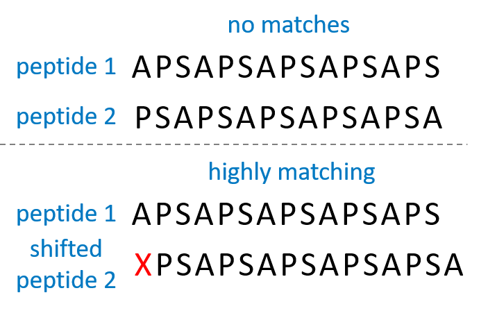

# Protein comparison

This repository contains a standalone Python3 script for comparing proteins by their primary amino acid sequence, as to determine how similar they are to each other.

## Setup

Simply download *protein_compare.py* and *example_data.txt* into the same folder. As the name suggests, *example_data.txt* contains random protein sequences formatted in a manner which *protein_compare.py* functions can process.

Development of this script has been done in Python version 3.7, but care has been taken to ensure backwards compatibility going back at least as far as Python 3.5.

The two external dependencies are **Matplotlib** and **Pandas**. These already come bundled with Python if you are using Anaconda. Otherwise you can install them from PyPI.

## Usage

### Preparing input data

To begin with, write your protein data into a space- and/or tab-separated .txt file, using *example_data.txt* as a guide. This script has been produced to compare the multiple binding loops of antibody-like proteins, hence each protein entry is broken up into numbered segments called "loops". When protein X is compared to protein Y, loop 1 of protein X is compared to loop 1 of protein Y, loop 2 to loop 2, loop 3 to loop 3, etc. and then these individual comparison scores are summed up. It is perfectly acceptable for each protein to have just a single loop.

### Comparing proteins

The first function you will call is *read_data*, which returns a **Pandas** DataFrame object containing all the proteins from your .txt file. This DataFrame is referred to within the script as *prot_seq*. It can be passed to one of the following three functions:

* **full_prot_comparison**\
A list of proteins (everything in *prot_seq* by default) is individually compared against every protein in *prot_seq*, including itself. You can specify which loops should be compared (just loop 1 by default) and restrict the first list of proteins to include only a few proteins of interest by specifying values for the *loops* and *proteins_of_interest* keyword arguments respectively. The third keyword argument is *shift*, which introduces [frameshift](https://github.com/TomaszKaminski-netizen/protein-compare#loop-comparison-and-frameshift) into the protein comparisons.

* **one_prot_all_shifts**\
One chosen protein is compared against every protein in *prot_seq* multiple times. Every time the [frameshift](https://github.com/TomaszKaminski-netizen/protein-compare#loop-comparison-and-frameshift) of the comparison changes, iterating through all the available possibilities.

* **all_prots_all_shifts**\
One at a time, all proteins in *prot_seq* are passed into the *one_prot_all_shifts* function. However, out of all the similarity scores created for each protein pair by different [frameshifts](https://github.com/TomaszKaminski-netizen/protein-compare#loop-comparison-and-frameshift), only the highest score is recorded. This compresses the data from 3 dimensions to just 2, making it easier to show graphically whilst still preserving the most important information.

### Loop comparison and frameshift
Protein loops (i.e. peptides) are compared by breaking them up into amino acid pairs; the sequence APT will be compared against WYT as A vs W, P vs Y, and T vs T. This leads to situations like the one illustrated below, where two almost identical peptides might get a very low similarity score because of how the amino acids were paired up.

Adding a single filler X amino acid at the beginning of peptide 2 rectifies the situation by shifting all the other amino acids into an appropriate comparison frame, which results in a high similarity score. This is called frameshift, and you can specify which peptide to add the X into and what position the X should be inserted at.

### Output data

The protein comparison results can be further processed by one of four functions:

* **heatmap**\
With the help of pyplot, the results can be visualised as a 2 dimensional heatmap.

* **write_csv_file**\
The resuts can be written into a .csv (comma-separated values) file, which can be opened using Microsoft Excel.

* **unpack_generators**\
The comparison algorithms make heavy use of generator functions and expressions, hence the final output of *one_prot_all_shifts*, *full_prot_comparison*, and *all_prots_all_shifts* contains a lot of generator objects. If you want to further manipulate this data you might need to turn these objects into normal tuples, which can be easily done by passing the data into *unpack_generators*.

* **turn_into_dataframe**\
The results can be turned into a **Pandas** DataFrame object, which is a table of comparison scores with labelled rows and columns. Because of this structure it is far easier to visually inspect than the nested tuples created by *unpack_generators*, and allows the user to utilise the broad range of powerful **Pandas** and **Numpy** data analysis functions.

### Other features

There are two other functions which users may wish to call:

* **amino_acid_properties_matrix**\
To find out how different amino acid pairs are scored by the comparison algorithm, run this function. It returns a BLOSUM-62-like matrix of comparison scores, which can be passed into any of the functions described in [output data](https://github.com/TomaszKaminski-netizen/protein-compare#output-data) for visualisation.

* **prot_structural_motifs**\
This function works on a single peptide, rather than *prot_seq*, and searches through it to find potential structural motifs, such as N-terminal alpha helix caps or salt bridges in an alpha helix. Instead of returning the found motifs as a variable, the results are printed to the console.

## Contributing

Currently not open to contributions, but comments with suggestions are welcome. This repository is being maintained by [TomaszKaminski-netizen](https://github.com/TomaszKaminski-netizen).

## License

This project is licensed under the MIT License - see the [LICENSE](https://github.com/TomaszKaminski-netizen/protein-compare/blob/master/LICENSE.txt) file for details.
